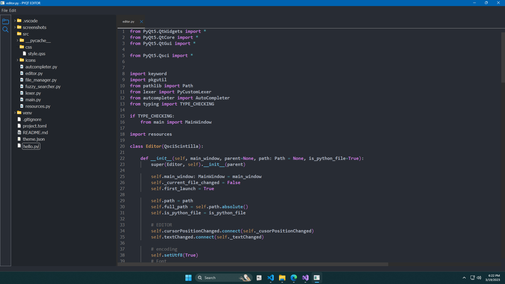

# pyqt-code-editor-yt

Part of a youtube series (Discontinued for now but still has alot of content)
You can find it here: https://www.youtube.com/playlist?list=PL_4y7TZU8zkc20vgwQSUG_FcwjxedfsjD

### Improved version
[**Neutron**](https://github.com/Fus3n/neutron), This is what the actual plan for the series was and where it was suposed to go, this still has alot missing but its overal alot improved from the last commit of the yt series, so if you know what you are doing you can take code from this to improve the current youtube version.

## Screenshots

More features will be added in the future
